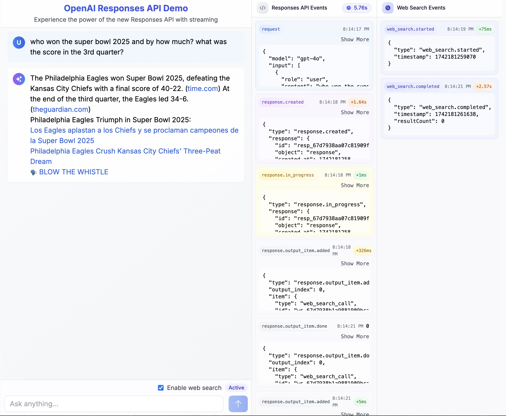

# OpenAI Responses API Demo

A real-time streaming demo application built with Next.js that showcases OpenAI's Responses API capabilities, including web search integration and event-driven response handling.



## Overview

This application demonstrates the capabilities of OpenAI's Responses API, a new offering that provides enhanced control over response generation and real-time event handling. The demo features a dual-panel interface that separates API events from response content, making it ideal for developers who want to understand the internals of OpenAI's streaming responses.

## Responses API vs Chat Completions API

The Responses API represents a significant evolution from the traditional Chat Completions API, offering several key differences:

1. **Event-Driven Architecture**: The fundamental difference between these APIs lies in how they handle streaming responses:

   ```javascript
   // Chat Completions API - Raw token streaming
   // The model sends back pieces of text (tokens) one at a time
   // You have to manually combine them into the final response
   for await (const chunk of completion) {
     content += chunk.choices[0].delta.content;
   }

   // Responses API - Semantic events
   // The API sends structured events that tell you exactly what's happening
   for await (const event of response) {
     switch (event.type) {
       case 'response.created': // Response creation started
       case 'response.in_progress': // Response generation in progress
       case 'response.output_item.added': // New output item added
       case 'response.content_part.added': // New content part added
       case 'response.output_text.delta': // New text content available
       case 'response.output_text.done': // Text content finalized
       case 'response.output_item.done': // Output item completed
       case 'response.content_part.done': // Content part completed
       case 'response.completed': // Response fully completed
       case 'response.failed': // Response failed
       case 'response.incomplete': // Response incomplete
       // Tool-specific events (like web search)
       case 'response.web_search_call.searching': // Web search started
       case 'response.web_search_call.results': // Search results available
       case 'response.web_search_call.completed': // Web search completed
       case 'response.web_search_call.failed': // Web search failed
     }
   }
   ```

   **Understanding Raw Tokens vs Semantic Events:**
   
   - **Raw Tokens**: Think of tokens as puzzle pieces of text. With the Chat Completions API, the model sends these pieces one by one. For example, the phrase "The cat sat" might come as three separate pieces: "The" + " cat" + " sat". You have to write code to collect and combine these pieces yourself, and you don't get any information about what the model is doing between tokens.
   
   - **Semantic Events**: The Responses API, instead, sends meaningful events that tell you exactly what's happening at each step. Rather than just getting pieces of text, you get structured information about the entire process. It's like having a play-by-play announcer telling you what's happening: "Starting the response... Now thinking... Adding some text... Looking up information... Done with this part... All finished!"

   **Why This Matters:**
   - **Better Control**: Instead of just collecting text pieces, you know exactly what stage the response is in, making it easier to build informative user interfaces.
   - **Built-in State Management**: The API tells you when it's thinking, searching, or done, so you don't have to guess what's happening.
   - **Tool Integration**: When the model needs to search the web or use other tools, you get specific events about what it's doing, making it easier to show progress to users.
   - **Error Handling**: You get clear events when something goes wrong, rather than having to figure it out from missing or malformed tokens.

2. **Built-in Tool Integration**: The Responses API natively supports tools like web search, file search, and computer use, making it a more comprehensive solution for building AI agents. The Chat Completions API requires more manual implementation for similar functionality.

3. **State Management**: The Responses API includes features like `previous_response_id` for managing conversation state, while Chat Completions requires manual state tracking.

4. **Structured Response Format**: Instead of the Chat API's simple `choices` array, the Responses API returns a typed `response` object with clear event types and structured data, making it easier to build type-safe applications.

## Demo App Key Highlights & Features

- **Real-time Event Streaming**: Visualize OpenAI's response generation process through a detailed event panel
- **Web Search Integration**: Enable real-time web search capabilities during response generation
- **Dual Panel Interface**:
  - **Left Panel**: Clean, distraction-free view of the generated response content
    - Markdown rendering support
    - Real-time text updates as they arrive
    - Clear visual distinction between user and assistant messages
  
  - **Right Panel**: Real-time event stream visualization
    - Color-coded event types for easy identification:
      - Purple: `response.created` - Response initialization
      - Yellow: `response.in_progress` - Active generation
      - Green: `response.output_text.delta` - Text updates
      - Blue: Web search events
      - Emerald: `response.completed` - Completion events
    - Event metadata for each update:
      - Timestamp of each event
      - Elapsed time since last event
      - Event-specific details (e.g., web search result counts)
    - Expandable event details for debugging
    - Chronological event history preserved for analysis
    - Real-time latency tracking between events
    
  This dual-panel approach provides developers with both the end-user experience (left) and a detailed technical view (right) of how the Responses API handles streaming, making it an ideal learning and debugging tool.
- **Modern Stack**: Built with Next.js 14, React, and Tailwind CSS

## Technical Implementation

### Event Streaming Architecture

The application uses Server-Sent Events (SSE) to stream responses in real-time. SSE is a web standard technology (part of HTML5) that enables servers to push data to web clients over a single, long-lived HTTP connection. Unlike WebSockets, SSE is unidirectional (server to client only) and automatically handles reconnection, making it ideal for streaming API responses.

**Why SSE for the Responses API?**
- Perfect fit for unidirectional streaming: The Responses API emits events in one direction (server to client)
- Native browser support: No additional libraries needed on the client side
- Automatic reconnection: Built-in retry mechanism if the connection drops
- Text-based protocol: Ideal for streaming JSON events
- Lower overhead than WebSockets: No need for bidirectional communication

**Implementation Details:**

1. **Server-Side (Next.js API Route)**:
```typescript
const stream = new ReadableStream({
  async start(controller) {
    const encoder = new TextEncoder();

    // Helper function to emit events
    const emitEvent = (data: any) => {
      controller.enqueue(
        encoder.encode(`data: ${JSON.stringify(data)}\n\n`)
      );
    };

    try {
      // Stream events from OpenAI's Responses API
      for await (const event of response) {
        switch (event.type) {
          case 'response.created':
            emitEvent({ type: 'event', value: event });
            break;
          case 'response.output_text.delta':
            emitEvent({ type: 'text', value: event.delta });
            break;
          // ... handle other events
        }
      }
    } catch (error) {
      emitEvent({ type: 'error', value: error });
    }
  }
});

// Return SSE stream with proper headers
return new StreamingTextResponse(stream);
```

2. **Client-Side (React/Next.js)**:
```typescript
// Using the Vercel AI SDK for simplified SSE handling
const { messages, handleSubmit } = useChat({
  api: '/api/chat',
  onResponse: (response) => {
    // Handle incoming SSE events
    const reader = response.body?.getReader();
    // Process events...
  }
});
```

**Event Flow:**
1. Client initiates request → Server creates SSE connection
2. OpenAI Responses API emits events → Server formats and streams events
3. Browser receives SSE events → React updates UI in real-time
4. Connection remains open until response completion or error

**Technical Benefits:**
- **Efficient Resource Usage**: SSE maintains a single connection instead of polling
- **Real-time Updates**: Events are pushed immediately as they occur
- **Graceful Error Handling**: Built-in error events and reconnection
- **Framework Support**: Works seamlessly with Next.js Edge Runtime
- **Type Safety**: Events are properly typed through the entire stack

This architecture enables us to provide a responsive, real-time interface that accurately reflects the event-driven nature of the Responses API, while maintaining a clean separation between the streaming infrastructure and the application logic.

### Vercel AI SDK Integration

This application leverages the [Vercel AI SDK](https://sdk.vercel.ai/docs) to simplify the integration between our Next.js frontend and the OpenAI Responses API. The SDK provides a set of utilities and hooks specifically designed for building AI-powered streaming applications.

**Why Vercel AI SDK?**
- **Simplified Streaming**: Handles SSE connection management and stream parsing
- **React Hooks**: Provides ready-to-use hooks like `useChat` for managing conversation state
- **TypeScript Support**: Full type safety for API responses and events
- **Edge Runtime Compatible**: Optimized for Next.js Edge Runtime and streaming responses
- **Framework Agnostic**: Works with various AI providers, not just OpenAI

**Implementation Benefits:**
```typescript
// Without Vercel AI SDK - Manual stream handling
const response = await fetch('/api/chat', {
  method: 'POST',
  body: JSON.stringify({ messages }),
});
const reader = response.body?.getReader();
const decoder = new TextDecoder();
while (true) {
  const { done, value } = await reader.read();
  if (done) break;
  const chunk = decoder.decode(value);
  // Manual parsing and state management...
}

// With Vercel AI SDK - Simplified implementation
const { messages, handleSubmit } = useChat({
  api: '/api/chat',
  onResponse: (response) => {
    // Automatic stream handling and parsing
  },
  onFinish: (message) => {
    // Clean completion handling
  },
});
```

**Key Features We Use:**
- `StreamingTextResponse`: Properly configured SSE response helper
- `useChat`: React hook for managing chat state and streaming
- `Message` types: Type definitions for chat messages
- Edge Runtime optimizations for faster response times

The SDK seamlessly connects our Next.js frontend with the Responses API's event-driven architecture, handling:
1. Stream connection management
2. Event parsing and typing
3. Message state management
4. Error handling and reconnection
5. TypeScript integration

Learn more about the SDK's capabilities in the [Vercel AI SDK documentation](https://sdk.vercel.ai/docs).

### Event Types

The application handles the following event types from the Responses API:

**Core Response Events:**
- `response.created`: Initial response creation started
- `response.in_progress`: Response generation is in progress
- `response.completed`: Response generation completed successfully
- `response.failed`: Response generation failed
- `response.incomplete`: Response generation was incomplete

**Content Events:**
- `response.output_item.added`: New output item added to the response
- `response.content_part.added`: New content part added
- `response.output_text.delta`: New text content available
- `response.output_text.done`: Text content has been finalized
- `response.output_item.done`: Output item completed
- `response.content_part.done`: Content part completed

**Web Search Events:**
- `response.web_search_call.searching`: Web search operation started
- `response.web_search_call.results`: Search results are available
- `response.web_search_call.completed`: Web search completed
- `response.web_search_call.failed`: Web search operation failed

Each event includes timestamps and elapsed time information, allowing you to track the duration of each step in the response generation process.

### Web Search Feature

The application integrates OpenAI's web search capability, allowing the model to access real-time information during response generation. The right panel provides a detailed view of the web search process:

1. **Setup**: Enable the "Enable web search" checkbox before asking your question
2. **Usage**: Ask a question about recent events, e.g., "Who won the last Super Bowl?"
3. **Event Visualization**: The right panel will display the web search lifecycle:
   - `response.web_search_call.searching`: Blue event indicator showing search initiation
   - `response.web_search_call.results`: Results available (if any found)
   - `response.web_search_call.completed`: Search completion with result count
   - `response.web_search_call.failed`: Error indicator if search fails

Each web search event includes:
- Precise timestamp
- Elapsed time since the previous event
- Expandable details showing:
  - Search parameters
  - Result counts
  - Success/failure status

This detailed event stream helps developers understand:
- When web searches are triggered
- How long searches take
- The volume and quality of results
- Any issues that arise during the search process

The right panel will show timestamps for each event, allowing you to track the duration of web searches and response generation in milliseconds.

## Getting Started

1. Clone the repository:
   ```bash
   git clone https://github.com/yourusername/responses-api-demo.git
   ```

2. Install dependencies:
   ```bash
   npm install
   ```

3. Create a `.env.local` file with your OpenAI API key:
   ```
   OPENAI_API_KEY=your_api_key_here
   ```

4. Start the development server:
   ```bash
   npm run dev
   ```

5. Open [http://localhost:3000](http://localhost:3000) in your browser

## API Configuration

The application uses the following OpenAI configuration:

- Model: gpt-4o (Note: The exact model name may change as OpenAI updates their API. Check the [OpenAI documentation](https://platform.openai.com/docs) for the latest model that supports web search)
- Temperature: 0.7
- Stream: Enabled
- Tools: Web search (optional)

## Development Notes

This project was created to explore the capabilities of OpenAI's Responses API, which provides more granular control over response generation compared to the traditional Chat Completions API. The implementation showcases:

- Event-driven architecture for handling streaming responses
- Real-time state management for concurrent events
- Integration with OpenAI's web search capability
- TypeScript types for response events and API interactions

## Requirements

- Node.js 18.x or higher
- OpenAI API key with access to GPT-4 models
- Modern web browser with SSE support

## Tech Stack

- [Next.js](https://nextjs.org/) - React framework
- [OpenAI Node.js SDK](https://github.com/openai/openai-node) - OpenAI API client
- [Tailwind CSS](https://tailwindcss.com/) - Styling
- [TypeScript](https://www.typescriptlang.org/) - Type safety
- [Vercel AI SDK](https://sdk.vercel.ai/docs) - AI utilities

## License

MIT
